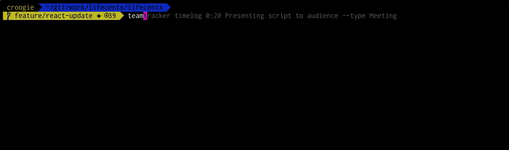

# TeamTracker CLI

With `teamtracker` you are able to log your hours without leaving your IDE. Based on Puppeteer script parses your command, logs into your TeamTracker account and adds timelog entry.

You're able to have separate config file for each project you are working on. You can skip information provided there executing your command.

<p align="center">
  
</p>

## Install

```bash
npm install --global teamtracker
```

or

```bash
yarn global add teamtracker
```

## Use

To log 1h 30m of Doing Something:
```bash
$ teamtracker timelog 1:30 Doing something
```

To change default task type use flag `--type`
```bash
$ teamtracker timelog 1:15 Release meeting --type Meeting
```

To define specific date use flag `--date`. 
(*by default you will log time for today*).
```bash
$ teamtracker timelog 0:25 Old task --date 2019-02-01
```

## Config file

In root of your project create file `.teamtrackerrc`.
In that file you can define flag values just to not pass them later from commandline 🤯

File may look like this:

```json
{
    "email": "michal.switon@venturedevs.com",
    "password": "yourSuperPassword",
    "project": "SuperSecretProject",
    "type": "Task"
}
```
